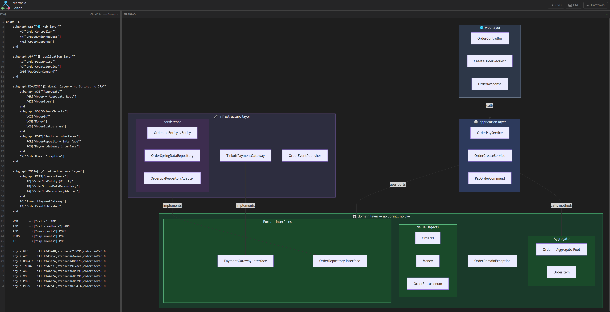
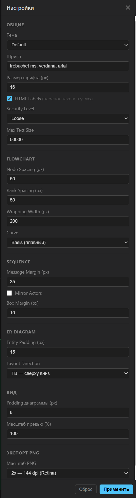
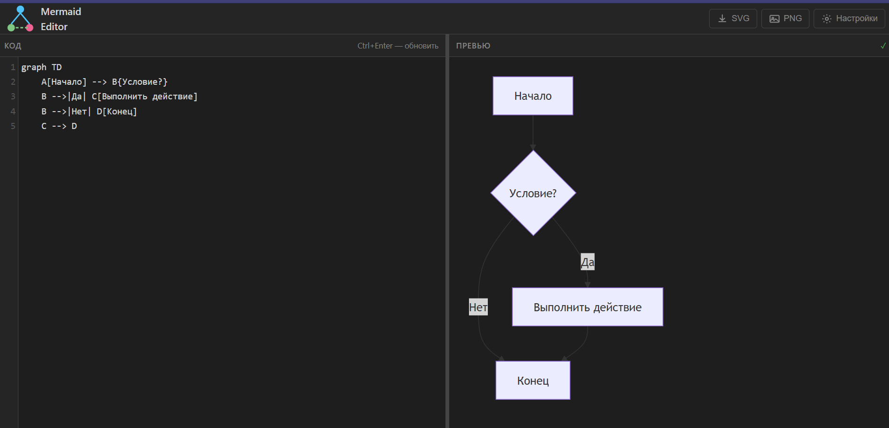
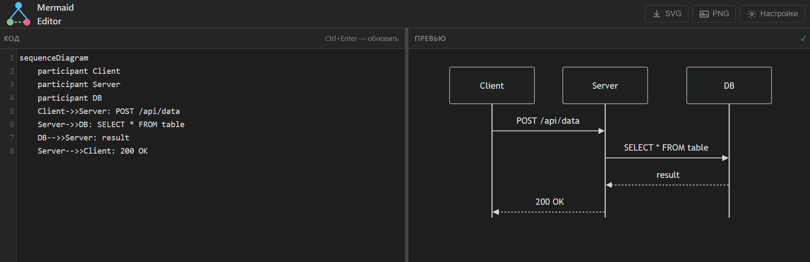
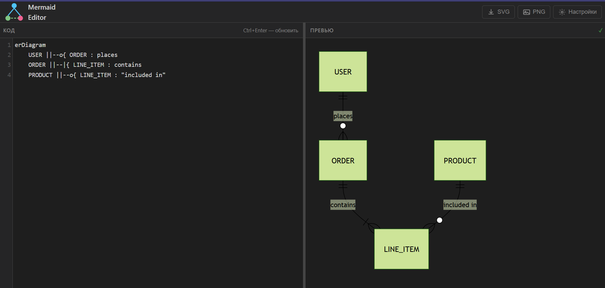
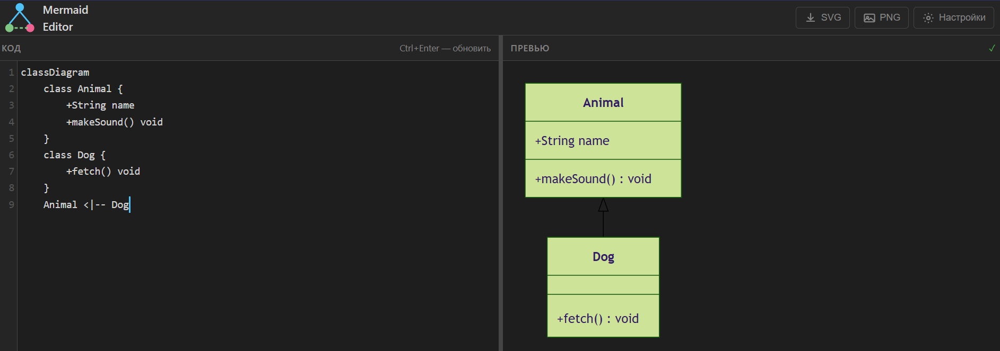

# Mermaid Editor — Руководство пользователя

Веб-приложение для создания и визуализации диаграмм Mermaid.  
Стек: Java 21 · Spring Boot 3.2 · Thymeleaf · Lombok · Gradle Groovy.

---

## Быстрый старт

### Требования

- JDK 21+
- Gradle 8+ (или используй wrapper `./gradlew`)

### Запуск

```bash
./gradlew bootRun
```

Открой браузер: [http://localhost:8080](http://localhost:8080)

---

## Структура проекта

```
mermaid-app/
├── build.gradle
├── settings.gradle
└── src/main/
    ├── java/ru/mcs/mermaid/
    │   ├── MermaidAppApplication.java   — точка входа
    │   ├── MermaidSettings.java         — in-memory бин настроек
    │   ├── MermaidSettingsDto.java      — DTO с валидацией
    │   └── MermaidController.java       — HTTP эндпоинты
    └── resources/
        ├── application.yml
        ├── templates/
        │   └── index.html               — Thymeleaf шаблон
        └── static/
            ├── css/
            │   ├── app.css              — стили приложения
            │   └── codemirror.min.css   — стили редактора (скачать)
            └── js/
                ├── app.js               — основная логика
                ├── codemirror.min.js    — редактор кода (скачать)
                └── mermaid.min.js       — рендер диаграмм (скачать)
```

---

## Сторонние библиотеки (скачать вручную)

Все JS/CSS хранятся локально в `static/` — внешних CDN нет.

| Файл | Куда положить | Ссылка |
|------|--------------|--------|
| `mermaid.min.js` | `static/js/` | https://cdn.jsdelivr.net/npm/mermaid@11/dist/mermaid.min.js |
| `codemirror.min.js` | `static/js/` | https://cdnjs.cloudflare.com/ajax/libs/codemirror/5.65.18/codemirror.min.js |
| `codemirror.min.css` | `static/css/` | https://cdnjs.cloudflare.com/ajax/libs/codemirror/5.65.18/codemirror.min.css |

---

## Интерфейс

### Редактор (левая панель)

- Поддерживает все типы диаграмм Mermaid: `flowchart`, `sequenceDiagram`, `erDiagram`, `gantt`, `classDiagram`, `pie` и др.
- Нумерация строк, перенос длинных строк
- **`Ctrl+Enter`** — принудительный перерендер диаграммы
- Автообновление с задержкой 500 мс после остановки ввода
- Разделитель между панелями **перетаскивается** мышью (от 20% до 80%)

### Превью (правая панель)

- Диаграмма рендерится прямо в браузере через Mermaid.js
- Статус рендера отображается в шапке панели: `✓` — успех, `✗ <текст ошибки>` — ошибка синтаксиса
- Масштаб превью настраивается в панели настроек

---

## Экспорт

### SVG

Кнопка **SVG** в шапке — скачивает векторный файл `diagram.svg`.  
SVG масштабируется без потери качества, подходит для вставки в документы и презентации.

### PNG

Кнопка **PNG** в шапке — скачивает растровый файл `diagram.png`.  
Разрешение определяется настройкой **Масштаб PNG** (см. ниже).

> **Ограничение:** диаграммы с включённым `HTML Labels` могут не экспортироваться в PNG из-за ограничений безопасности браузера (`<foreignObject>` в SVG заражает canvas). В этом случае отключи `HTML Labels` в настройках или используй экспорт в SVG.

---

## Настройки

Кнопка **Настройки** (шестерёнка) открывает боковую панель.  
Изменения применяются кнопкой **Применить** — диаграмма перерендерится автоматически.  
Кнопка **Сброс** возвращает все параметры к значениям по умолчанию.



### Общие

| Параметр | По умолчанию | Описание |
|----------|-------------|----------|
| Тема | `default` | Цветовая схема: `default`, `dark`, `forest`, `neutral`, `base` |
| Шрифт | `trebuchet ms, verdana, arial` | CSS font-family для текста внутри диаграммы |
| Размер шрифта | `16` px | Диапазон: 8–72 px |
| HTML Labels | включено | Разрешает перенос текста в узлах. При включении экспорт PNG может быть недоступен |
| Security Level | `loose` | `strict` — запрещает HTML, `loose` — разрешает, `antiscript` — без скриптов |
| Max Text Size | `50000` | Максимальный размер текста диаграммы в символах |

### Flowchart

| Параметр | По умолчанию | Описание |
|----------|-------------|----------|
| Node Spacing | `50` px | Расстояние между узлами на одном уровне |
| Rank Spacing | `50` px | Расстояние между уровнями иерархии |
| Wrapping Width | `200` px | Ширина блока, после которой текст переносится на новую строку |
| Curve | `basis` | Стиль линий: `basis` — плавный, `linear` — угловой, `cardinal` |

### Sequence

| Параметр | По умолчанию | Описание |
|----------|-------------|----------|
| Message Margin | `35` px | Отступ между стрелками сообщений |
| Mirror Actors | выключено | Дублировать участников внизу диаграммы |
| Box Margin | `10` px | Отступ внутри блоков `box` |

### ER Diagram

| Параметр | По умолчанию | Описание |
|----------|-------------|----------|
| Entity Padding | `15` px | Внутренний отступ в блоках сущностей |
| Layout Direction | `TB` | Направление: `TB` — сверху вниз, `BT`, `LR`, `RL` |

### Вид

| Параметр | По умолчанию | Описание |
|----------|-------------|----------|
| Padding диаграммы | `8` px | Отступ вокруг всей диаграммы |
| Масштаб превью | `100` % | CSS `transform: scale()` на превью. Не влияет на экспорт |

### Экспорт PNG

| Параметр | По умолчанию | Описание |
|----------|-------------|----------|
| Масштаб PNG | `2x` | `1x` — 72 dpi, `2x` — 144 dpi (Retina), `3x` — 216 dpi, `4x` — 288 dpi |

---

## API эндпоинты

Настройки хранятся в памяти и доступны через REST:

| Метод | URL | Описание |
|-------|-----|----------|
| `GET` | `/` | Главная страница редактора |
| `GET` | `/api/settings` | Текущие настройки в JSON |
| `POST` | `/api/settings` | Обновить настройки (JSON body) |
| `POST` | `/api/settings/reset` | Сбросить настройки к дефолтам |

> Настройки хранятся **в памяти** — после перезапуска приложения сбрасываются к значениям по умолчанию.

---

## Примеры диаграмм

### Flowchart

```
graph TD
    A[Начало] --> B{Условие?}
    B -->|Да| C[Выполнить действие]
    B -->|Нет| D[Конец]
    C --> D
```



### Sequence

```
sequenceDiagram
    participant Client
    participant Server
    participant DB
    Client->>Server: POST /api/data
    Server->>DB: SELECT * FROM table
    DB-->>Server: result
    Server-->>Client: 200 OK
```


### ER Diagram

```
erDiagram
    USER ||--o{ ORDER : places
    ORDER ||--|{ LINE_ITEM : contains
    PRODUCT ||--o{ LINE_ITEM : "included in"
```


### Class Diagram

```
classDiagram
    class Animal {
        +String name
        +makeSound() void
    }
    class Dog {
        +fetch() void
    }
    Animal <|-- Dog
```

